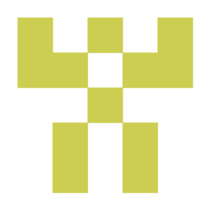

# nilx.one

**Protocol and ecosystem namespace for identities, pairwise interactions, and verifiable digital systems.**

A child organization of [aiaiaiai tech.](https://github.com/aiaiaiai-org) and the home of the [`0x1`](https://github.com/nilx-one/0x1) protocol product.

[nilx.one](https://nilx.one) · [0x1](https://github.com/nilx-one/0x1) · [mind](https://github.com/nilx-one/mind)

---

## Namespace

`nilx.one` is the organization and ecosystem namespace. It is not a synonym for `0x1` and may contain multiple protocols, products, and documentation surfaces over time.

`0x1` models one causally bounded reciprocal interaction between exactly two Bonds. Completed interactions become BondChain facts; the longer-lived Relationship is derived from their history.

## Repositories

| Repository | Role |
| --- | --- |
| [`0x1`](https://github.com/nilx-one/0x1) | Canonical protocol specification and product architecture. |
| [`core`](https://github.com/nilx-one/core) | Deterministic Rust product core shared by official clients. |
| [`web`](https://github.com/nilx-one/web) | Canonical Web client family, including messenger Mini Apps. |
| [`ai`](https://github.com/nilx-one/ai) | Product-specific artificial intelligence runtime behind the protocol boundary. |
| [`mind`](https://github.com/nilx-one/mind) | Durable organization and namespace context. |
| [`.github`](https://github.com/nilx-one/.github) | Organization profile and shared GitHub configuration. |

## Public surfaces

- [nilx.one](https://nilx.one) — canonical public surface.
- [mind.nilx.one](https://mind.nilx.one) — living visual map of identities, organizations, systems, and products.

[Parent: aiaiaiai tech.](https://github.com/aiaiaiai-org) · [Owner: 0x0sky](https://github.com/0x0sky) · [Sibling: 0xda-market](https://github.com/0xda-market)

<!-- © 2026 aiaiaiai · aiaiaiai.org -->
